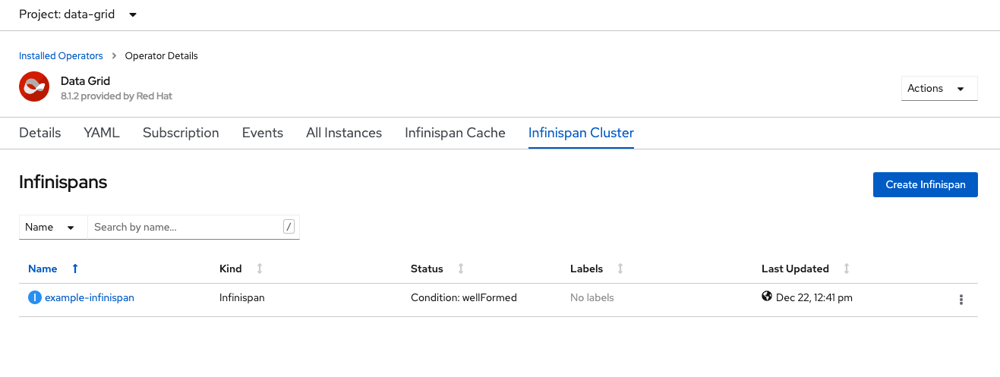
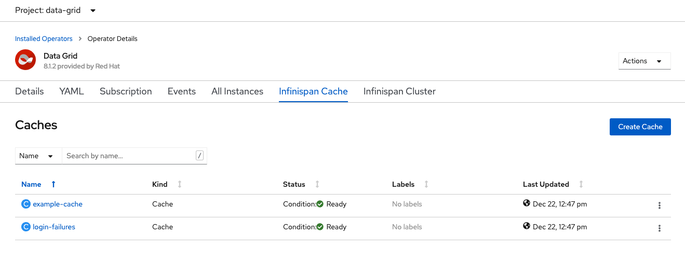
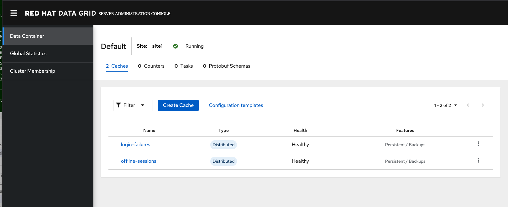
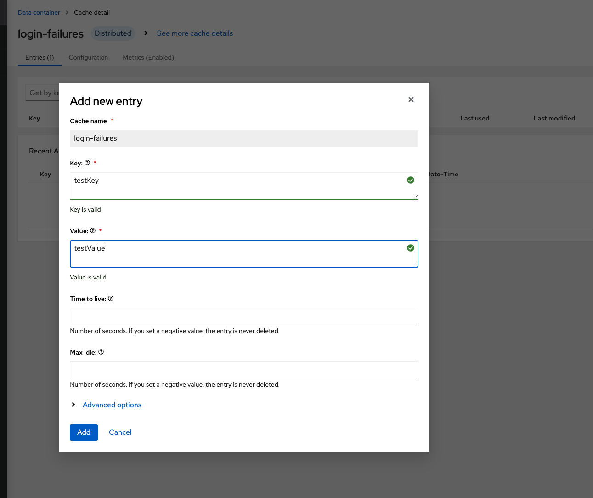

Instructions to deploy cross-site DataGrid replication, based on:

https://access.redhat.com/documentation/en-us/red_hat_data_grid/8.0/html-single/running_data_grid_on_openshift/index#backup_sites

Prerequisites

* Two OpenShift clusters (OCP 4.4+), with cluster admin privelidges

For the purpose of this PoC we're going to call our clusters site1 and site2

We will need to switch between environments so we're going to setup environment variables to make this easier

Login to site1 using the oc tool

Set an environment variable with the login token

`export SITE1_LOGIN_TOKEN=$(oc whoami -t)`

Set an environment variable with the OpenShift api for site 1

e.g. 
`export SITE1_API=https://api.cluster-4842.yyyyyy.xxxxxx.com:6443`

Repeat these steps for site2

Login to site2 using the oc tool

Set an environment variable with the login token

`export SITE2_LOGIN_TOKEN=$(oc whoami -t)`

Set an environment variable with the OpenShift api for site 1

e.g. 
`export SITE2_API=https://api.secondary-4842.yyyyyy.xxxxxx.com:6443`

# Steps to deploy x-site replication


## SITE 1

Login to site1

`oc login --token=$SITE1_LOGIN_TOKEN --server=$SITE1_API`

Create a service account

`oc create sa site1`

Add view role to sa in data-grid namespace

`oc policy add-role-to-user view system:serviceaccount:data-grid:site1`

Get token from site1 sa

`export SITE1_TOKEN=$(oc sa get-token site1)`

## SITE 2

Login to site2

`oc login --token=$SITE2_LOGIN_TOKEN --server=$SITE2_API`

Create a service account

`oc create sa site2`

Add view role to sa in data-grid namespace

`oc policy add-role-to-user view system:serviceaccount:data-grid:site2`

Get token from site1 sa

`export SITE2_TOKEN=$(oc sa get-token site2)`

Create secret for site1 token

`oc create secret generic site1-token --from-literal=token=$SITE1_TOKEN`

## SITE 1

Login to site1

`oc login --token=$SITE1_LOGIN_TOKEN --server=$SITE1_API`

Create secret for site2 token

`oc create secret generic site2-token --from-literal=token=$SITE2_TOKEN`

Deploy the DataGrid cluster

`oc apply -f ./cross-site/site1.yml`

Locate the secret: example-infinispan-generated-secret and copy the developer password

Update the file rhdg-client-auth-secret.yml with the developer password

Create the rhdg-client-auth secret

`oc apply -f rhdg-client-auth-secret.yml`

Create the caches

`oc apply -f ./cross-site/example-cache-site1.yml`

Deploy the DataGrid console

`oc apply -f data-grid-console.yml`

## SITE 2

Login to site2

`oc login --token=$SITE2_LOGIN_TOKEN --server=$SITE2_API`

Deploy the DataGrid cluster

`oc apply -f ./cross-site/site2.yml`

Locate the secret: example-infinispan-generated-secret and copy the developer password

Update the file rhdg-client-auth-secret.yml with the developer password

Create the rhdg-client-auth secret

`oc apply -f rhdg-client-auth-secret.yml`

Create the caches

`oc apply -f ./cross-site/example-cache-site2.yml`

Deploy the DataGrid console

`oc apply -f data-grid-console.yml`

# Testing

Once the DataGrid cluster is deployed, you should see the following on each cluster

```
oc get pods
NAME                                  READY   STATUS    RESTARTS   AGE
example-infinispan-0                  1/1     Running   0          53m
example-infinispan-1                  1/1     Running   0          52m
infinispan-operator-b6ccc6797-mrqgg   1/1     Running   0          24h
```

From the OpenShift console, navigate to "Installed Operators" -> "Data Grid"

Click on the "Infinispan Cluster" tab, you should see:



Click on the "Infinispan Cache" tab, you should see:



Next we'll login to the DataGrid console and test the cross-site replication

On site1, locate the secret: example-infinispan-generated-secret and copy the operator password

Goto the Routes tab and click on the Route to open the DataGrid console

Click on the "Go to the console" button

In the login prompt, enter the username: operator and the password copied from the previous step

You should see the console as shown:



Click on "login-failures"

Click on "Add entry"

Create a test entry as shown below and click on "Add":



On site2, locate the secret: example-infinispan-generated-secret and copy the operator password

Goto the Routes tab and click on the Route to open the DataGrid console

Click on the "Go to the console" button

In the login prompt, enter the username: operator and the password copied from the previous step

Navigate to the login-failures cache detail

In the search box, enter the key created in the previous step and click on the search icon

You should see the entry replicated on site2

